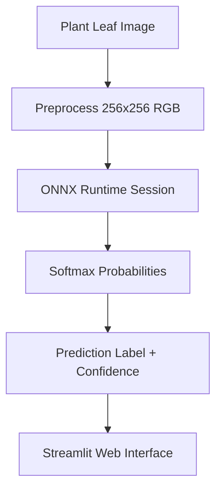

# 🌿 Plant Disease Detection - ResNet18 · ONNX · Streamlit · Docker

[]()
[]()
[]()
[]()
[]()
[](LICENSE)

**Plant Disease Detection** is a deep learning project that classifies **38 plant diseases** across ~70,000 leaf images using a ResNet18 CNN fine-tuned with PyTorch. The trained model is exported to **ONNX** for optimized inference with onnxruntime and served through an interactive **Streamlit** web interface that is fully containerized with **Docker**.

---

## ✨ Key Features

### 🎯 1. ResNet18 Image Classifier
- Fine-tuned ResNet18 from `torchvision.models`, pretrained on ImageNet.
- Classifies **38 classes** (Apple, Tomato, Grape, Potato, Corn, and more) from the New Plant Diseases Dataset.

### ⚡ 2. ONNX Model Export & Inference
- Model exported to `plant_disease_model.onnx` with ONNX Runtime for fast, portable inference.
- `plant_inference.py` loads the ONNX session and returns the top class label with a softmax confidence percentage.

### 🔍 3. Streamlit Web Interface
- Upload a leaf image (JPG/JPEG/PNG) and get an instant prediction with confidence.
- Side-by-side display of the uploaded image and the prediction result.

### 📊 4. Docker Containerization
- Two-stage Docker setup: `base.Dockerfile` (dependencies) and `app.Dockerfile` (app + model).
- Single-command deployment of the Streamlit server.

---

## 🏗️ System Architecture



---

## 🛠️ Technology Stack

### Backend / Core
- **Language**: Python 3.11
- **Deep Learning**: PyTorch + torchvision (ResNet18)
- **Inference Engine**: ONNX Runtime (`onnxruntime`)

### Data & Processing
- **Data Manipulation**: numpy, pandas
- **Image Processing**: Pillow (PIL)
- **Dataset Download**: gdown (New Plant Diseases Dataset)

### Frontend / Web Interface
- **Web App**: Streamlit
- **Notebook Utilities**: importnb

### Deployment
- **Containerization**: Docker (base + app Dockerfiles)
- **Ports**: App runs on port `8051` (Streamlit)

---

## 🚀 Getting Started

### Prerequisites
- **Python 3.11** or Docker
- **Dataset**: [New Plant Diseases Dataset](https://www.kaggle.com/datasets/vipoooool/new-plant-diseases-dataset) (downloaded via the `downloading_data.ipynb` notebook)

### 1. Repository Setup
```bash
git clone https://github.com/MarwanAbdellah/plant_disease_detection.git
cd plant_disease_detection
```

### 2. Docker Deployment
```bash
# Step 1: Build the base image with dependencies
docker build -f base.Dockerfile -t plant_base .

# Step 2: Build the app image
docker build -f app.Dockerfile -t plant_app .

# Step 3: Run the Streamlit app
docker run -p 8051:8051 plant_app
```

### 3. Local Development Setup
```bash
# Install required packages
pip install onnxruntime numpy pandas streamlit gdown importnb

# Prepare the dataset (run the notebooks in order)
# notebooks/downloading_data.ipynb  → download dataset
# notebooks/data_warehouse.ipynb    → build data_warehouse.csv
# notebooks/training.ipynb          → train ResNet18 & export to ONNX
```

### 4. Run the Web Interface
```bash
streamlit run app.py
```
Open your browser at `http://localhost:8051` and upload a plant leaf image to get a prediction.

---

## 🧪 Testing & Verification

No automated test suite is included; verify the pipeline as follows:

- **Training**: monitor training loss/accuracy in `notebooks/training.ipynb` and confirm the ONNX model is exported.
- **Inference**: call `predict(img_path)` from `plant_inference.py` directly and confirm a sensible class label + confidence.
- **Web App**: upload sample leaf images in Streamlit and confirm predictions render with confidence scores.

---

## 📁 Project Structure

```text
plant_disease_detection/
├── app.py                    # Streamlit web interface
├── plant_inference.py        # ONNX Runtime prediction logic
├── images_preprocessing.py   # Image preprocessing (256x256, normalized)
├── data_warehouse.csv        # Image path → class mapping (70,295 rows, 38 classes)
├── base.Dockerfile           # Base image with dependencies
├── app.Dockerfile            # App image (model + Streamlit server)
├── notebooks/
│   ├── downloading_data.ipynb   # Dataset download
│   ├── data_warehouse.ipynb     # Build data warehouse CSV
│   └── training.ipynb           # ResNet18 training + ONNX export
├── .gitignore
└── README.md
```

> Note: `plant_disease_model.onnx` is gitignored (`*.onnx`) and produced during training.

---

## 👤 Author

**Marwan Abdellah**
- **GitHub**: [@MarwanAbdellah](https://github.com/MarwanAbdellah)
- **LinkedIn**: [Marwan Abdellah](https://www.linkedin.com/in/marwan-abdellah/)

---

## 📄 License

Distributed under the MIT License. See `LICENSE` for more information.
